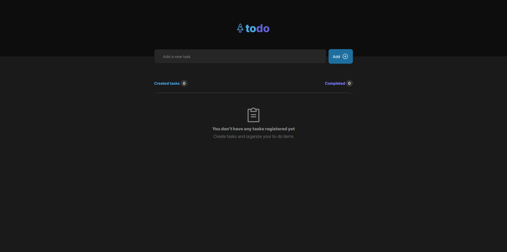
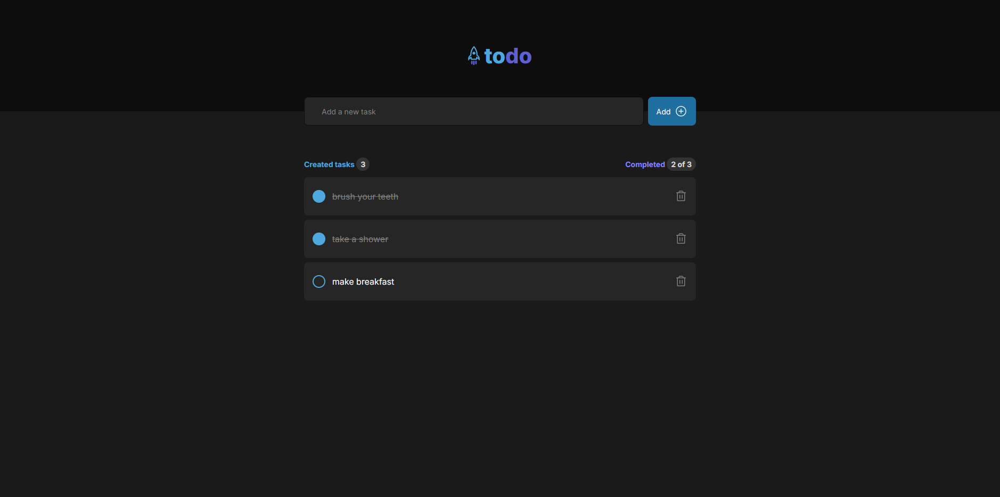
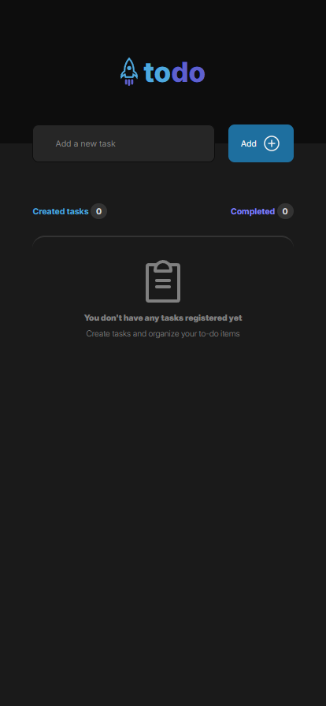
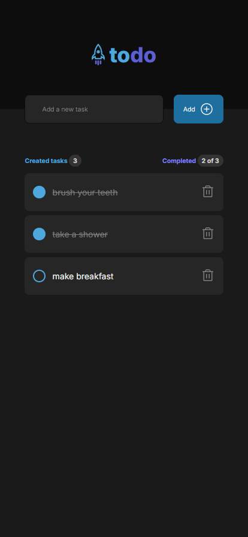

# To-Do List App

A sleek and efficient task management app built with **React** and **TypeScript**, designed to enhance productivity with a clean UI and smooth user experience.

This project was developed after completing **Level 1** of the **ReactJS course** on **Rocketseat**. It serves as a challenge to reinforce the most important **ReactJS** and **TypeScript** concepts studied during the first level.

## 🚀 Features

- ✅ **Add, and Delete Tasks** – Manage your tasks seamlessly.
- 🎨 **Modern UI** – A clean and responsive interface.

## 🛠️ Tech Stack

- **Frontend:** React, TypeScript
- **State Management:** React Hooks

## 📸 Screenshots

### Empty Task List View



### Task List with Items



### Empty Task List - Responsive View



### Task List with Items - Responsive View




## 📂 Installation & Usage

1. Clone the repository:
   ```bash
   git clone https://github.com/GKsegura/todo-app-ts.git
   cd todo-list-app
   ```
2. Install dependencies:
   ```bash
   npm install
   ```
3. Start the development server:
   ```bash
   npm run dev
   ```
4. Open [http://localhost:5173](http://localhost:5173) in your browser.

## 📜 License

This project is licensed under the **MIT License**.

---

⭐ **Star this repo if you find it useful!**
